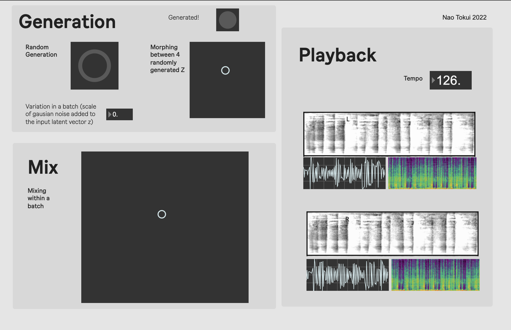

# LoopGAN — StyleGAN2 + MelGAN Audio Loop Generation

This repository is heavily dependent on [the official repository](https://github.com/allenhung1025/LoopTest) of the following paper:
`Hung, Tun-Min, Bo-Yu Chen, Yen-Tung Yeh, and Yi-Hsuan Yang. 2021. “A Benchmarking Initiative for Audio-Domain Music Generation Using the Freesound Loop Dataset.”` [[arxiv]](https://arxiv.org/pdf/2108.01576.pdf)

## Environment

Tested in Python 3.8.

``` bash
$ pip install -r requirements.txt 
```

## Pre-trained Models

* We provide a pre-trained StyleGAN2 model trained on spectrograms of various drum beats of electronic dance music.
``` bash
$ gdown -O drumbeats1_230000.pt 1B3ZWTJFuZbPPH4uIIz-pCcBTLu9-w4nw
```

## Run the notebook

* run `jupyter notebook` and open `./generate_audio.ipynb`
``` bash
$ jupyter notebook
```


- In this notebook, the StyleGAN model generates a batch of loops (batch size: 4) with a random input vector Z. Before being fed to the model, gaussian noise is added to the vector so that each loop is slightly different from each other. Then, you can mix them smoothly on the provided Max patch (see below).
- If you play two loops from a batch in stereo, you'll get interesting stereo effects, depending on the noise you added to the Z. 
- The script saves a batch of 4 loops as a single 4-channel audio file for easy handling.
- Also, when you run the script, four Z vectors are selected randomly as "Z presets". You can "morph" on the Max patch between these four presets.   

## Max Patch

- We provide a Max/MSP patch to interact with the notebook.
- "Mix" section lets you mix loops within a batch. 

<p>

</p>
  

## Disclaimer

- You can run the jupyter notebook on the CPU, but it will be painfully slow to use it for any live performances.
- For the actual live performance, I used two buffers for each channel and cross-faded between these two buffers every time a new batch of loops is generated to realize smooth transitions between batches. 
 

## Training
- You can train your own StyleGAN2 model using scripts in [the original repository](https://github.com/allenhung1025/LoopTest) 


